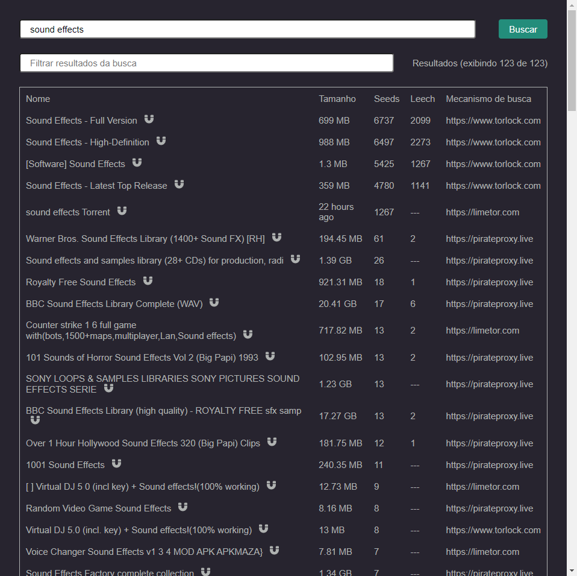
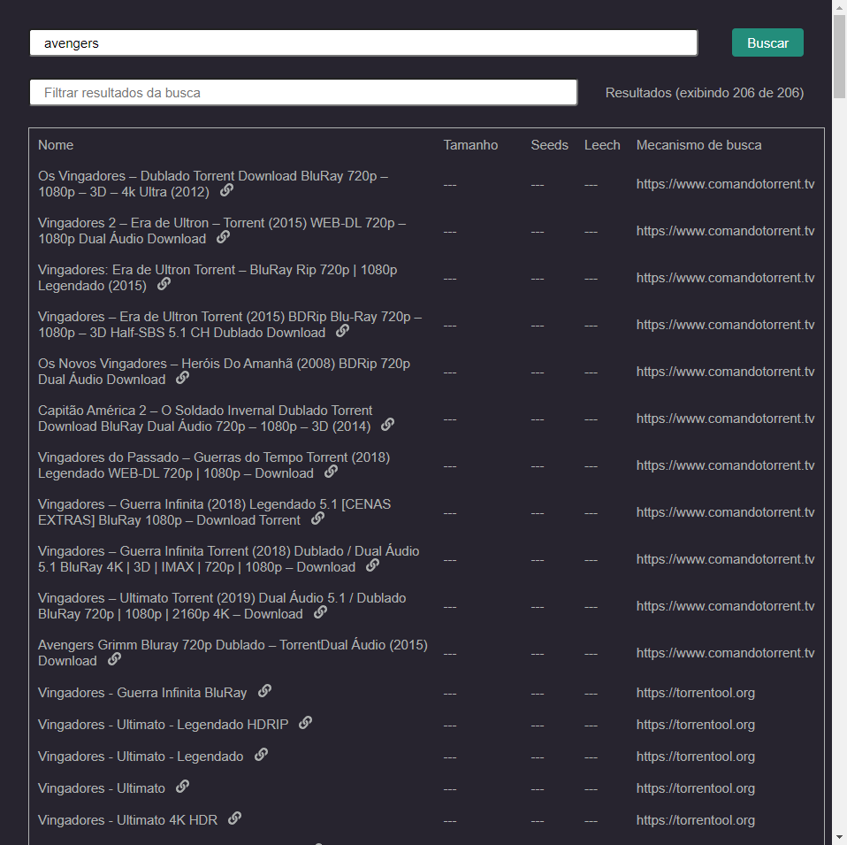

# Magnet Finder

<div flex-direction="row">
  
    
</div>

<div align="center">
    
    <br />
    
</div>

<br />
<strong>Encontre magnet links sem precisar acessar sites manualmente, um por um.</strong>
<br />
<br />

<strong>Usado como referência a busca do </strong><a href="https://github.com/qbittorrent/search-plugins/wiki/Unofficial-search-plugins#plugins-for-public-sites">QBittorrent</a>

Backend utilizado: <a href="https://github.com/MarceloVilela/scrapping">https://github.com/MarceloVilela/scrapping</a>
## Demonstração

Caso deseje visualizar a aplicação antes de instalar, você pode acessar o <a href="https://magnetfinder.netlify.app/">link da aplicação</a> que está hospedada na Netlify.

## Para executar locamente:

#### 1.Pré-requisitos

Antes de começar, você vai precisar ter instalado em sua máquina as seguintes ferramentas:
[Git](https://git-scm.com), [Node.js](https://nodejs.org/en/). 
Além disto é bom ter um editor para trabalhar com o código como [VSCode](https://code.visualstudio.com/)

#### 2.Instalação

Para a instalação do projeto, primeiramente baixe o <a href="https://nodejs.org/en/">Node.js</a>.

Após a instalação do Node, você deve clonar o repositório:
```bash
git clone https://github.com/MarceloVilela/magnetfinder.git
```
Após a clonagem, execute o comando abaixo dentro da pasta do projeto para baixar todas as dependências:
```bash
npm install
```

#### 3.Variáveis ambiente
Crie um arquivo .env, 
copie o conteúdo do arquivo .env.staging.example e cole dentro de .env,
altere caso necessário.

#### 4.Inicializar

Após clonar, execute o comando abaixo:

```bash
npm run start
```

Abra [http://localhost:3000](http://localhost:3000) em seu navegador para utilizar a aplicação.